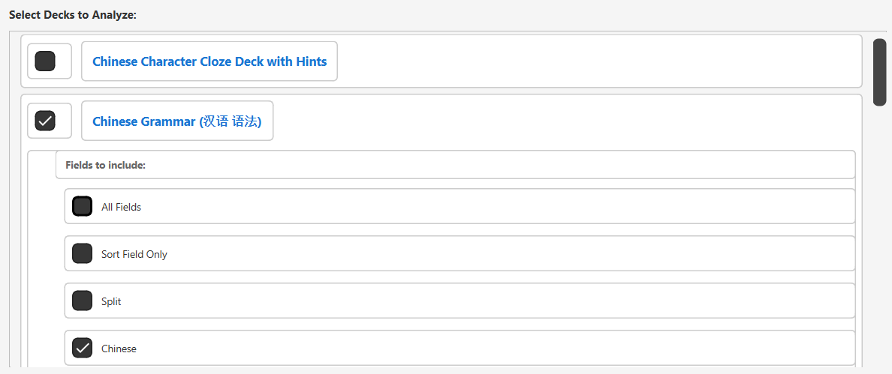
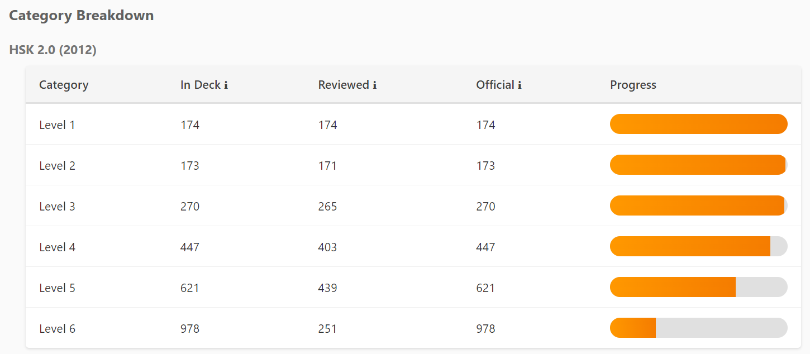
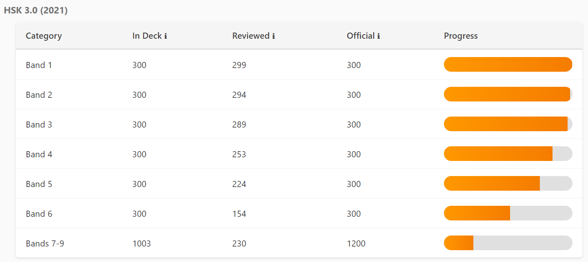
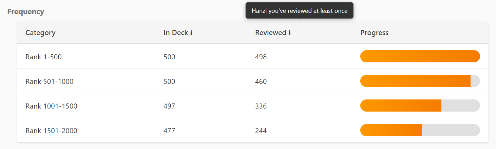
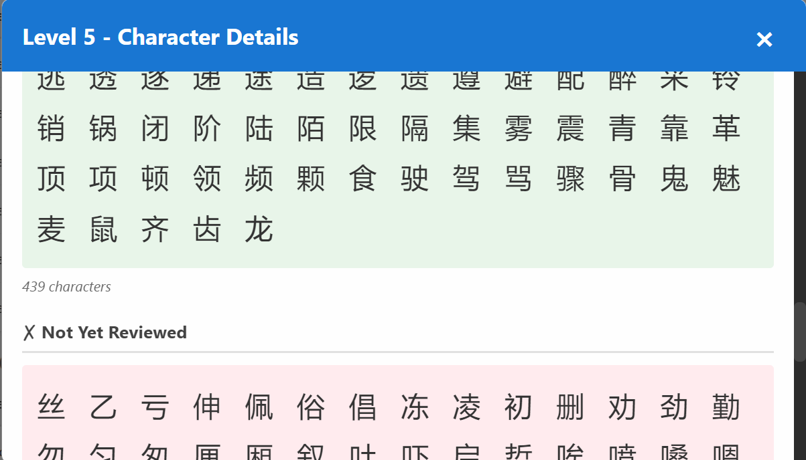

# Hanzi Deck Statistics

An Anki addon that tracks how many Hanzi (Chinese characters) you've seen in each deck, with detailed breakdowns by HSK level and frequency.

## Screenshots

### Deck Selection

*Multi-select decks with per-deck field and subdeck options*

### HSK 2.0 (2012) Breakdown

*Track progress through HSK 2.0 levels 1-6*

### HSK 3.0 (2021) Breakdown

*Comprehensive HSK 3.0 coverage with bands 1-9*

### Frequency Analysis

*Character frequency rankings based on Jun Da corpus*

### Character Details

*Click any category to see reviewed, missing, and not-in-deck characters*

## Features

- **Multi-Deck Selection**: Select multiple decks simultaneously with checkboxes
- **Per-Deck Configuration**: Choose specific fields and subdecks for each deck independently
- **Combined Statistics**: All selections merge into a single comprehensive view
- **Auto-Refresh**: Statistics update instantly when selections change
- **Two Metrics**:
  - **Total Hanzi**: All unique characters in the deck (including new cards)
  - **Reviewed Hanzi**: Characters you've actually studied
- **Category Breakdowns**:
  - HSK 2.0 (2012) - Levels 1-6
  - HSK 3.0 (2021) - Bands 1-9
  - Frequency rankings (Rank 1-500, 501-1000, 1001-1500, 1501-2000)
- **Interactive Details**: Click any category to see specific characters (reviewed, missing, not in deck)
- **Persistent Settings**: Your selections are remembered across sessions
- **Modern Data Sources**: Uses up-to-date HSK 3.0 and frequency data from comprehensive corpora
- **Beautiful UI**: Clean, compact interface with progress bars and responsive design

## Installation

### Method 1: Manual Installation (Development)

1. Clone or download this repository to: `C:\Users\Jonathan\Documents\repos\hanzi-deck-stats`

2. Find your Anki addons folder:
   - Open Anki
   - Go to **Tools → Add-ons**
   - Click **View Files**
   - This opens your addons21 folder

3. Create a folder named `hanzi_deck_stats` in the addons21 folder

4. Copy all files from this repository into that folder:
   ```
   addons21/hanzi_deck_stats/
   ├── __init__.py
   ├── stats_calculator.py
   ├── stats_dialog.py
   ├── hanzi_detector.py
   ├── character_data.py
   ├── config.json
   ├── config.md
   ├── manifest.json
   └── datasets/
       ├── hsk30-chars.csv
       └── mega_hanzi_compilation.csv
   ```

5. Restart Anki

### Method 2: AnkiWeb (Future)

Once published to AnkiWeb, you can install via:
- **Tools → Add-ons → Get Add-ons**
- Enter the addon code

## Usage

1. Open Anki
2. Go to **Tools → Hanzi Deck Stats**
3. Select one or more decks using checkboxes
4. For each selected deck, expand options to:
   - Choose which fields to analyze (e.g., Hanzi, Pinyin, English)
   - Select which subdecks to include
5. Statistics automatically update as you make selections
6. Your choices are saved and restored next time

### Understanding the Statistics

**Total Hanzi**: All unique Hanzi characters found in cards in the deck, including new unseen cards. This shows the total learning material available.

**Reviewed Hanzi**: Unique Hanzi from cards you've reviewed at least once (cards with review history). This shows what you've been exposed to.

**Progress Bars**: Visual representation of how many characters you've reviewed vs. total.

**Category Breakdown**: Shows how many characters you've seen from each HSK level or frequency band.

**Interactive Categories**: Click any category row to see a detailed modal showing:
- ✓ Reviewed Characters (green)
- ✗ Not Yet Reviewed (red)
- ⊘ Not in Deck (orange, for HSK categories only)

## Configuration

Access configuration via **Tools → Add-ons → Hanzi Deck Statistics → Config**

### Options

- **showCategories**: Whether to show HSK/frequency breakdowns (true/false)

- **categoriesToShow**: List of categories to display (see config.md for options)

- **selectedDecks**: Automatically saved dictionary of your deck/field/subdeck selections (managed by the UI)

Note: Field and subdeck selections are now managed per-deck through the UI and automatically saved. The old global `fieldToUseForStats` and `includeSubdecks` options have been replaced by per-deck selections.

## Data Sources

This addon uses modern, comprehensive Chinese language datasets:

- **HSK 2021 (HSK 3.0)**: Official 3,000 characters from [ivankra/hsk30](https://github.com/ivankra/hsk30)
- **HSK 2012**: Legacy HSK levels from comprehensive compilation
- **Frequency Data**: 11,266 characters from [alyssabedard/chinese-hsk-and-frequency-lists](https://github.com/alyssabedard/chinese-hsk-and-frequency-lists), based on Jun Da's Modern Chinese Character Frequency List (193 million character corpus)

## Technical Details

### Character Detection

- Uses Unicode-based detection for CJK Unified Ideographs (U+3400-U+9FFF)
- Includes CJK Compatibility Ideographs (U+F900-U+FAFF)
- Normalizes all characters to NFC form for consistency

### Database Queries

The addon queries Anki's database to find:
- **Total cards**: `cards.queue >= 0` (active cards, excluding suspended/buried)
- **Reviewed cards**: Cards with entries in the `revlog` table

### Performance

- Efficient SQL queries with proper indexing
- Progress indicators for long operations
- Caches character categorization data for speed

## Development

### Project Structure

```
hanzi-deck-stats/
├── __init__.py              # Main entry point, menu integration
├── stats_calculator.py      # Core statistics calculation logic
├── stats_dialog.py          # UI dialog window
├── hanzi_detector.py        # Character detection utilities
├── character_data.py        # CSV data loader and categorization
├── config.json              # Default configuration
├── config.md                # Configuration documentation
├── manifest.json            # Addon metadata
├── datasets/                # Character data files
│   ├── hsk30-chars.csv
│   └── mega_hanzi_compilation.csv
└── README.md
```

### Requirements

- Anki 2.1.49 or later
- Python 3.9+ (included with Anki)
- PyQt5/PyQt6 (included with Anki)

### Building from Source

1. Clone the repository
2. Ensure datasets are in the `datasets/` folder
3. Copy to Anki addons folder (see Installation above)

## License

MIT License - see LICENSE file for details

## Credits

- Character data: [ivankra/hsk30](https://github.com/ivankra/hsk30) and [alyssabedard/chinese-hsk-and-frequency-lists](https://github.com/alyssabedard/chinese-hsk-and-frequency-lists)
- Frequency data: Jun Da's Modern Chinese Character Frequency List
- Inspired by the original Hanzi_Stats addon

## Support

For issues, questions, or feature requests, please file an issue on GitHub.

## Changelog

### Version 1.0.0 (2025-11-09)

- Initial release with multi-deck selection
- Multi-deck selection with checkboxes (no "All Decks" option)
- Per-deck field selection with actual field names from note types
- Per-deck subdeck selection with individual checkboxes
- Combined statistics across all selected decks and fields
- Auto-refresh on any checkbox change
- Persistent settings (selections saved across sessions)
- Interactive character detail modals
- HSK 2.0 (2012) support with levels 1-6
- HSK 3.0 (2021) support with bands 1-9
- Frequency rankings based on Jun Da corpus (ranks 1-500, 501-1000, 1001-1500, 1501-2000)
- Official HSK character lists with "Not in Deck" tracking
- Modern, compact UI with collapsible deck options
- Comprehensive character data from multiple sources
- Fixed: Character counts now accurate (simplified only, no traditional duplicates)
